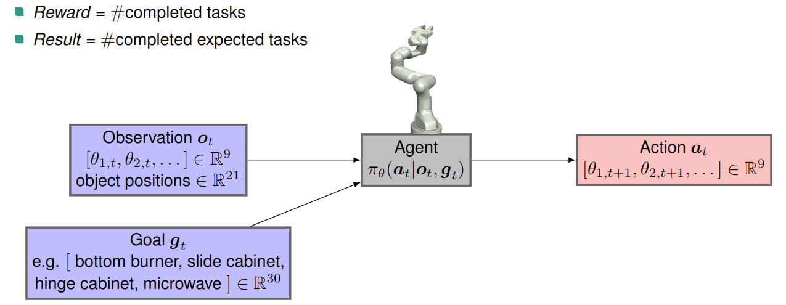
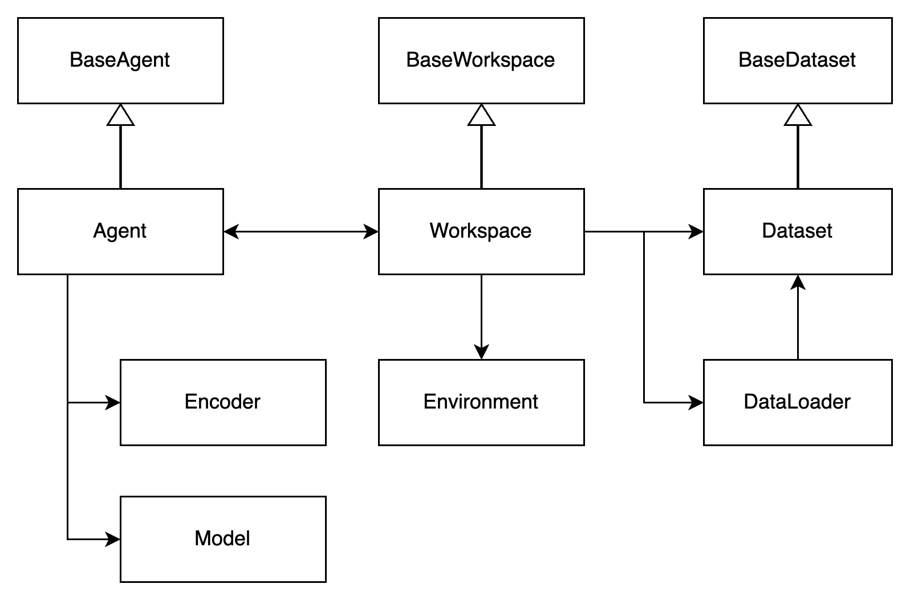
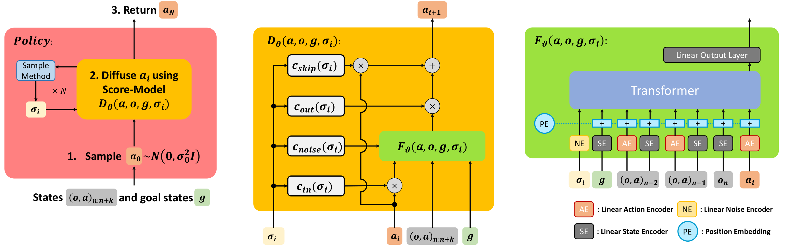

# Beso

[Paper](https://arxiv.org/pdf/2304.02532), [Project Page](https://intuitive-robots.github.io/beso-website), [RSS 2023](https://roboticsconference.org/)

[Moritz Reuss](https://mbreuss.github.io/moritzreuss/)<sup>1</sup>,
[Maximilian Li](https://irl.anthropomatik.kit.edu/21_67.php)<sup>1</sup>,
[Xiaogang Jia](https://irl.anthropomatik.kit.edu/21_78.php)<sup>1</sup>,
[Rudolf Lioutikov](http://rudolf.intuitive-robots.net/)<sup>1</sup>

<sup>1</sup>Intuitive Robots Lab, Karlsruhe Institute of Technology

Official code for "Goal Conditioned Imitation Learning using Score-based Diffusion Policies" 

## Installation Guide

First create a conda environment using the following command

```bash
sh install.sh
```

During this process two additional packages will be installed:

- [Relay Policy Learning](https://github.com/google-research/relay-policy-learning)

To add relay_kitchen environment to the PYTHONPATH run the following commands:

```
conda develop <path to your relay-policy-learning directory>
conda develop <path to your relay-policy-learning directory>/adept_envs
conda develop <path to your relay-policy-learning directory>/adept_envs/adept_envs
```

**Dataset**

To download the dataset for the Relay Kitchen and the Block Push environment from the given link and repository, and adjust the data paths in the ```franka_kitchen_main_config.yaml``` and ```block_push_main_config.yaml``` files, follow these steps:

1. Download the dataset: Go to the [link](https://osf.io/q3dx2/) from [play-to-policy](https://github.com/jeffacce/play-to-policy) and download the dataset for the Relay Kitchen and Block Push environments.

2. Unzip the dataset: After downloading, unzip the dataset file and store it.

3. Adjust data paths in the configuration files:

Open the ```./configs/franka_kitchen_main_config.yaml``` and set the data_path argument to ```<path_to_dataset>/relay_kitchen```.
Open the ./configs/block_push_main_config.yaml and set the data_path argument to ```<path_to_dataset>/multimodal_push_fixed_target```
After adjusting the data paths in both configuration files, you should be ready to use the datasets in the respective environments.

---

### Code Overview



All configurations are managed using configs from [hydra](https://hydra.cc/docs/intro/), a hierarchical configuration manager. Each configuration component is represented as a separate file within a lower-level folder.  The main configuration file for each environment can be found under the ```/configs``` directory. To train and test an agent, you need to run the desired config file within the ```scripts/training.py``` method. The repo uses WandB to log and monitor all runs, please add your wandb account to the config together with a project name.\
Hydra needs absolute paths, so please change the default paths in your code ```/path/to/beso``` to your local path.

We provide two environments, the Franka Kitchen and the Block Push environment with goal-conditioned extensions.
These two are based on the code of [play-to-policy](https://github.com/jeffacce/play-to-policy).
To switch the environment, such as from the Franka kitchen to the block pushing, in the ```scripts/training.py``` code, you need to replace the following code snippet:

```python
@hydra.main(config_path="configs", config_name="franka_kitchen_main_config.yaml")
def main(cfg: DictConfig) -> None:
```
to
```python
@hydra.main(config_path="configs", config_name="block_push_config.yaml")
def main(cfg: DictConfig) -> None:
```

An overview of the individual classes used to implement the model is depicted below:


The workspace class manages the environment and dataset related to the task at hand. The agent class encapsulates the model and training algorithm, serving as a wrapper to test the policy on the environment.

---

### Train an agent

There exist the general ```training.py``` file to train a novel agent and evaluate its performance after
the training process. 
A new agent can be trained using the following command:

```bash
[beso]$ conda activate play 
(play)[beso]$ python scripts/training.py 
```
To train the CFG-variant of BESO change the following parameter:
```bash
[beso]$ conda activate play 
(play)[beso]$ python scripts/training.py cond_mask_prob=0.1
```

We can easily train the agent on 10 seeds sequentially by using:
```bash
[beso]$ conda activate play 
(play)[beso]$ python scripts/training.py --multirun seed=1,2,3,4,5,6,7,8,9,10
```

---

### Understanding BESO



An overview of the action generation process of BESO is visualized above. New actions are generated during rollouts with the ```predict``` method of the
```beso_agent```. Inside  ```predict``` we call the ```sample_loop``` to start the action denoising process.
Depending on the chosen sampler, the required function from ```beso/agents/diffusion_agents/k_diffusion/gc_sampling.py``` is called. 
This process is visualized on the left part of the Figure. The pre-conditioning wrapper of the denoising model, as shown in the middle, is implemented in the GCDenosiser class ```beso/agents/diffusion_agents/k_diffusion/score_wrappers.py```. The score-transformer is then called from ```beso/agents/diffusion_agents/k_diffusion/score_gpts.py``` as shown in the right part of the figure.


### Evaluation

We provide several pre-trained models for testing under ```trained_models```.
If you want to evaluate a model and change its inference parameters you can run the following script:
```bash
python scripts/evaluate.py
```
To change parameters for diffusion sampling, check out out ```configs/evaluate_kitchen``` and ```configs/evaluate_blocks```, where there is an detailed overview of all inference parameters. Below we provide an overview of important parameters and the available implementations for each. 


#### BESO sampling customizations

BESO is based on the continuous-time score diffusion model of [Karras et al. 2022](https://arxiv.org/pdf/2206.00364.pdf), which allows to adapt several hyperameters for fast sampling. Below is an overview of the parameters, which can be optimzied on tasks for further performance improvement:

*Number of Denoising Steps*

We can control the number of denoising steps by adapting the parameter: ```n_timesteps```.

*Sampler*

One can easily swap the used sampler for BESO, by changing the related parameter in the config ```agents.beso_agent.sampler_type``` with one of the following options:

- ```'ddim'``` _sample_ddim_
- ```'heun'``` _sample_heun_
- ```'euler_ancestral'``` _sample_euler_ancestral_
- ```'euler'``` _sample_euler_
- ```'dpm'```  _sample_dpm_2_
- ```'ancestral'``` _sample_dpm_2_ancestral_
- ```'dpmpp_2s'``` _sample_dpmpp_2s_
- ```'dpmpp_2s_ancestral'``` _sample_dpmpp_2s_ancestral_
- ```'dpmpp_2m'``` _sample_dpmpp_2m_
- ```'dpmpp_2m_sde'``` _sample_dpmpp_2m_sde_

The most robust sampler in our experiments has been the ```DDIM``` sampler. We found, that the ```Euler Ancestral``` excels in the kitchen environment. To start with, we recommend to use the ```DDIM``` sampler.

*Time steps*

There exist several implementations of time steps schedulers from common diffusion frameworks:

- ```'exponential'```: Exponential Scheduler
- ```'linear'```: Default Linear Scheduler 
- ```'karras'```: Sampler proposed in [Karras et al. 2022](https://arxiv.org/pdf/2206.00364.pdf)
- ```'cosine'```: Cosine beta scheduler from [Nichol, Alexander Quinn, and Prafulla Dhariwal. 2021](https://arxiv.org/pdf/2102.09672.pdf)
- ```'iddpm'```: Noise schedule from [IDDPM](https://openreview.net/forum?id=-NEXDKk8gZ)
- ```'vp'```: Variance Preserving noise schedule from [Song et al. 2021](https://arxiv.org/pdf/2011.13456)
- ```'ve'```: Variance Exploding noise schedule from [Song et al. 2021](https://arxiv.org/pdf/2011.13456)

The exponential or linear scheduler worked best for our experiments. However, its worth to try out all samplers on a new environment to get the best performance.

---


### Acknowledgements

This repo relies on the following existing codebases:

- The goal-conditioned variants of the environments are based on [play-to-policy](https://github.com/jeffacce/play-to-policy).
- The inital environments are adapted from [Relay Policy Learning](https://github.com/google-research/relay-policy-learning), [IBC](https://github.com/google-research/ibc) and [BET](https://github.com/notmahi/bet).
- The continuous time diffusion model is adapted from [k-diffusion](https://github.com/crowsonkb/k-diffusion) together with all sampler implementations. 
- the ```score_gpt``` class is adapted from [miniGPT](https://github.com/karpathy/minGPT).
- A few samplers are adapted from [dpm-solver](https://github.com/LuChengTHU/dpm-solver)

---

## Citation

```bibtex
@inproceedings{
    reuss2023goal,
    title={Goal Conditioned Imitation Learning using Score-based Diffusion Policies},
    author={Reuss, Moritz and Li, Maximilian and Jia, Xiaogang and Lioutikov, Rudolf},
    booktitle={Robotics: Science and Systems},
    year={2023}
}
```

---